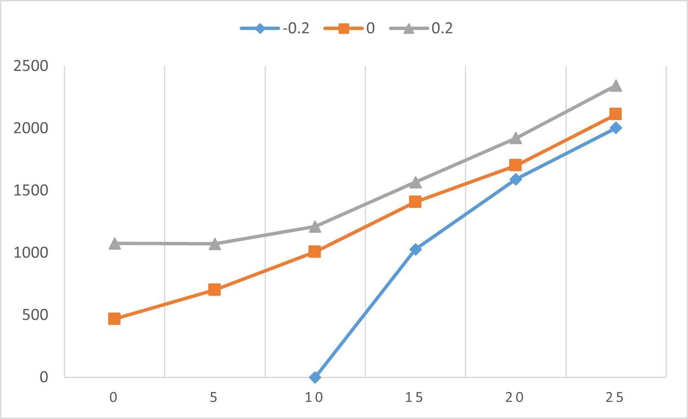
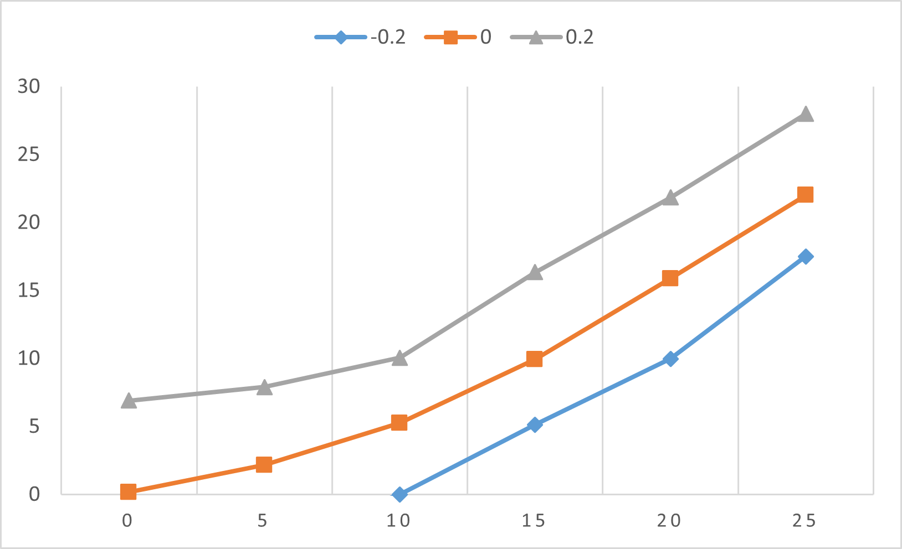

# Temperature and Material Properties Simulation

## Overview
This project contains simulations to analyze temperature distribution and material properties using specific physical equations. Two separate simulations are performed to observe different phenomena and properties based on varying input parameters.

## Features
- **Simulation 1:** Calculates temperature distribution based on altitude and different values of \(P_0\) using specific physical constants.
- **Simulation 2:** Computes material properties \(k\) and \(H\) for varying values of \(cG\) and different \(P_0\) using another set of physical constants.

## Results

### Simulation 1
The results for different values of \(P_0\) and altitude are summarized below. The temperature at different altitudes for each \(P_0\) value is computed and visualized in the image `1.png`.

| \(P_0\) | Altitude (z) | Temperature (T) |
|---------|--------------|------------------|
| -0.2    | 0            | -1044.265        |
| -0.2    | 5            | -1234.547        |
| -0.2    | 10           | -0.0003          |
| -0.2    | 15           | 1027.018         |
| -0.2    | 20           | 1591.64          |
| -0.2    | 25           | 2003.391         |
| 0       | 0            | 467.917          |
| 0       | 5            | 701.497          |
| 0       | 10           | 1007.3           |
| 0       | 15           | 1407.018         |
| 0       | 20           | 1701.036         |
| 0       | 25           | 2111.732         |
| 0.2     | 0            | 1075.31          |
| 0.2     | 5            | 1071.85          |
| 0.2     | 10           | 1211.369         |
| 0.2     | 15           | 1567.371         |
| 0.2     | 20           | 1921.16          |
| 0.2     | 25           | 2344.301         |

### Simulation 2
The results for different values of \(cG\) and \(P_0\) are presented in the image `2.png`. This simulation calculates material properties \(k\) and \(H\) and their dependency on \(cG\) and \(P_0\).

| \(P_0\) | \(cG\) | \(k\) | \(H\) |
|---------|--------|-------|-------|
| -0.2    | 0      | -6.01 | 0.154 |
| -0.2    | 5      | -3.75 | 2.146 |
| -0.2    | 10     | 0.001 | 5.24  |
| -0.2    | 15     | 5.134 | 9.923 |
| -0.2    | 20     | 9.974 | 15.873|
| -0.2    | 25     | 17.497| 22.011|
| 0       | 0      | 0.154 | 6.894 |
| 0       | 5      | 2.146 | 7.894 |
| 0       | 10     | 5.24  | 10.049|
| 0       | 15     | 9.923 | 16.337|
| 0       | 20     | 15.873| 21.838|
| 0       | 25     | 22.011| 27.995|
| 0.2     | 0      | 6.894 | 6.894 |
| 0.2     | 5      | 7.894 | 7.894 |
| 0.2     | 10     | 10.049| 10.049|
| 0.2     | 15     | 16.337| 16.337|
| 0.2     | 20     | 21.838| 21.838|
| 0.2     | 25     | 27.995| 27.995|

## Code Structure
- **Simulation 1:** Initializes parameters, calculates temperature for different altitudes and values of \(P_0\), and writes results to `result.xlsx`.
- **Simulation 2:** Computes material properties \(k\) and \(H\) for varying \(cG\) and values of \(P_0\), and writes results to `result.xlsx`.

## Dependencies
- **C++ Standard Library**: Utilized for basic input/output operations.
- **fstream**: Used for file operations to store simulation results.

